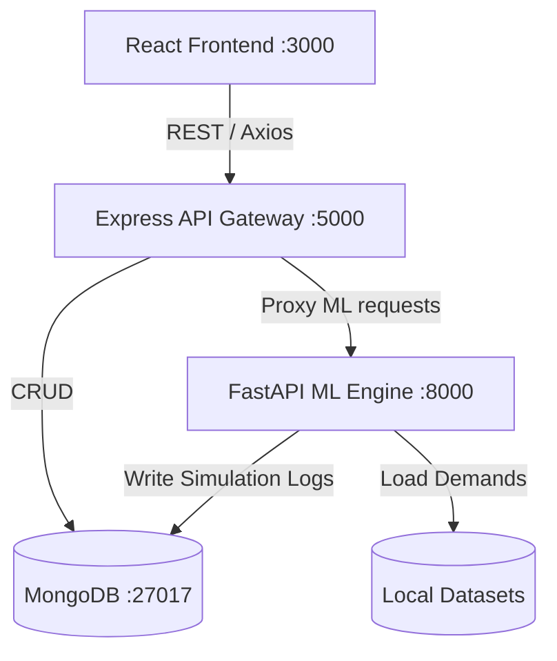

# ReliefNet: Flood Relief India — AI Engine v3.0

ReliefNet is a research-grade framework for **Stochastic Dynamic Post-Flood Inventory Allocation for India**. It combines state-of-the-art Machine Learning and Operations Research to solve the humanitarian logistics problem of distributing multi-commodity relief materials (food, water, medicine, shelter) to flood-affected districts.

**Version 3.0 introduces six novel research contributions** building on the core v2.0 platform: Constrained Equity RL, Multi-Agent RL (MAPPO), Stochastic Road Failures, Explainable RL (XRL), GNN-Accelerated MIP Solving, and a Gymnasium benchmark environment.

---

## 1. Project Overview

**What does it do?**
ReliefNet simulates and optimises post-disaster humanitarian logistics. It predicts flood trends via an LSTM, estimates district demand via a Random Forest, formulates the problem as a Markov Decision Process (MDP), and runs multiple state-of-the-art decision algorithms to determine optimal resource allocation.

**The Problem It Solves:**
Manual supply allocation fails under stochastic demand, infrastructure disruption, and communication latency. ReliefNet automates these decisions using Reinforcement Learning, ensuring both efficiency and — critically — fairness across all affected districts.

**System Architecture:**
React handles the UI and GIS visualisations. A Node.js Express server handles standard CRUD and proxies heavy simulation requests to a Python FastAPI ML engine backed by PyTorch, PuLP, and scikit-learn.

---

## 2. Tech Stack

### Frontend
- **React.js** (v18+), **React Router DOM**, **Leaflet / React-Leaflet** (GIS Map)

### Backend Services
- **Express.js API Server** (Port 5000), **FastAPI ML Engine** (Port 8000)

### ML & Operations Research
- **PyTorch** — LSTM flood predictor, all RL agents (PPO, VFA, MAPPO, AttentionPPO, ConstrainedPPO)
- **Scikit-Learn** — Random Forest Demand Estimator
- **PuLP** — Mixed Integer Programming (MIP + GNN Warm-Start)
- **SciPy / NumPy / Pandas**
- **Gymnasium** — Standard RL benchmark environment wrapper

### Testing
- **Pytest** — ML Core Unit Tests (16 tests total)

### Database & DevOps
- **MongoDB** (Async Motor for Python, Mongoose for Node.js)
- **Docker Compose** (Multi-container orchestration)

---

## 3. System Architecture & Data Flow



**Data Flow:**
1. User configures a simulation via the React Dashboard.
2. React sends `POST /api/simulations` to Express.
3. Express logs the simulation (status: `"pending"`) in MongoDB and relays to FastAPI.
4. FastAPI runs a `BackgroundTask` — chosen RL agent evaluates stochastic scenarios.
5. Results (allocations, costs, attention weights, equity scores) are saved to MongoDB.
6. The React frontend polls for results and renders the GIS allocation overlay.

---

## 4. Project Folder Structure

```text
ReliefNet/
│
├── frontend/                   # React.js SPA
│   ├── src/
│   │   ├── api/                # Axios configurations
│   │   ├── components/         # Layout, Navigation
│   │   ├── pages/              # Dashboard, Simulation, Districts
│   │   └── App.js
│   └── package.json
│
├── express-server/             # Node.js API Gateway
│   ├── src/
│   │   ├── config/             # Environment setup
│   │   ├── controllers/        # Business logic
│   │   ├── models/             # Mongoose schemas
│   │   ├── routes/             # REST API routes
│   │   └── index.js
│   └── package.json
│
├── backend/                    # Python FastAPI ML Engine
│   ├── app/
│   │   ├── auth/               # JWT authentication
│   │   ├── data/               # Demand estimators, cost calculators
│   │   ├── ml/                 # All RL agents and research modules (see §5)
│   │   ├── models/             # Pydantic request/response schemas
│   │   ├── routers/            # FastAPI endpoints
│   │   └── main.py             # FastAPI entrypoint
│   ├── datasets/               # Historic CSV flood data
│   ├── tests/                  # Pytest unit tests
│   └── requirements.txt
│
├── Research Papers/            # Reference literature
└── docker-compose.yml
```

---

## 5. ML Module Reference (`backend/app/ml/`)

### Core MDP Framework
| File | Description |
|------|-------------|
| `base_agent.py` | Abstract base class — all agents implement `get_action()`, `evaluate()`, `train()` |
| `config.py` | Central `SimulationConfig` frozen dataclass (60+ hyperparameters for all agents) |
| `mdp.py` | `DistrictState`, `MDPState`, `MDPTransition`, `ScenarioGenerator` — the core MDP formulation. `compute_cost()` supports optional road failure masks. |
| `deprivation.py` | Exponential deprivation cost functions (Holguin-Veras et al., 2013) |

### Demand & Supply Forecasting
| File | Description |
|------|-------------|
| `demand_model.py` | `DemandForecaster` — Random Forest Regressor trained on district flood history |
| `flood_predictor.py` | PyTorch LSTM predicting 3–7 day District Flood Severity Index (DFSI) sequences |

### Decision Agents
| File | Method | Description |
|------|--------|-------------|
| `rule_based.py` | `rule_based` | Static urgency-score heuristic baseline |
| `dl_vfa.py` | `dl_vfa` | Decomposed Linear Value Function Approximation |
| `nn_vfa.py` | `nn_vfa` | Neural Network Value Function Approximation |
| `ppo.py` | `ppo` | Proximal Policy Optimization with Dirichlet actor |
| `mip_solver.py` | `mip` | PuLP/CBC exact MIP solver with warm-starting |
| `perfect_info.py` | `perfect_info` | Deterministic LP lower-bound benchmark |

### Research Improvements (v3.0)
| File | Method | Research Contribution |
|------|--------|-----------------------|
| `equity.py` | — | Gini coefficient, Max-Min fairness gap, equity penalty helpers |
| `constrained_ppo.py` | `constrained_ppo` | **Improvement 1** — PPO + Lagrangian equity constraint (dual variable auto-tunes fairness vs efficiency trade-off) |
| `marl_env.py` | — | Multi-agent environment with stochastic communication drops and partial observations |
| `mappo.py` | `mappo` | **Improvement 2** — Multi-Agent PPO (CTDE): per-warehouse actor, shared centralised critic |
| `road_network.py` | — | Sigmoid DFSI-driven edge failure model; `sample_failure_mask()` + `effective_transport_cost()` |
| `attention_ppo.py` | `attention_ppo` | **Improvement 4** — Transformer self-attention actor; `explain_last_action()` returns per-district weights for GIS overlay |
| `explainability.py` | — | `build_decision_explanation()` → structured JSON for React GIS map overlay |
| `gnn_warm_start.py` | — | **Improvement 5** — 2-layer GCN predicts MIP warm-start; `train_from_mip_history()` for supervised training on logged solutions |
| `gymnasium_env.py` | — | **Improvement 6** — Standard `gymnasium.Env` wrapper: `FloodReliefEnv` with Box obs/action spaces |

### Evaluation
| File | Description |
|------|-------------|
| `benchmark.py` | `BenchmarkRunner` — evaluates all 9 agents under identical seeds; returns gap-to-perfect-info DataFrame |
| `multi_depot.py` | Multi-depot warehouse coordination |
| `multi_commodity.py` | Multi-commodity greedy allocation fallback |

---

## 6. Quick Start (Docker — Recommended)

Ensure Docker Desktop and Docker Compose are installed.

```bash
# 1. Clone the repository
git clone <repo-url>
cd ReliefNet

# 2. Launch all services
docker-compose up --build
```

| Service | URL |
|---------|-----|
| React Frontend | http://localhost:3000 |
| FastAPI ML Engine (Swagger UI) | http://localhost:8000/docs |
| Express API | http://localhost:5000/api |
| MongoDB | localhost:27017 |

---

## 7. Running Services Individually (Without Docker)

### Prerequisites
- Python 3.10+, Node.js 18+, MongoDB running on port 27017

### Step 1 — FastAPI ML Backend

```bash
cd backend

# Create and activate virtual environment
python -m venv venv
# Windows:
venv\Scripts\activate
# macOS / Linux:
source venv/bin/activate

# Install all dependencies (includes gymnasium, torch, pulp, etc.)
pip install -r requirements.txt

# Start FastAPI
uvicorn app.main:app --host 0.0.0.0 --port 8000 --reload
```

> Interactive API docs available at **http://localhost:8000/docs**

### Step 2 — Express API Server

```bash
cd express-server
npm install
npm run dev
```

### Step 3 — React Frontend

```bash
cd frontend
npm install
npm start
```

---

## 8. Running Tests

From the `backend/` directory (with the virtual environment activated):

```bash
cd backend
pytest tests/test_ml_core.py -v
```

### Expected Test Output (16 tests)

```
tests/test_ml_core.py::test_deprivation_cost_zero                   PASSED
tests/test_ml_core.py::test_deprivation_cost_increases              PASSED
tests/test_ml_core.py::test_marginal_deprivation_nonnegative        PASSED
tests/test_ml_core.py::test_mdp_transition_inventory_nonnegative    PASSED
tests/test_ml_core.py::test_mdp_transition_zero_allocation          PASSED
tests/test_ml_core.py::test_mip_solver_feasible_small               PASSED
tests/test_ml_core.py::test_mip_solver_empty_inventory              PASSED
tests/test_ml_core.py::test_scenario_generator_nonnegative          PASSED
tests/test_ml_core.py::test_benchmark_runner_runs                   PASSED
tests/test_ml_core.py::test_equity_gini_perfect_equality            PASSED  ← Improvement 1
tests/test_ml_core.py::test_equity_gini_worst_case                  PASSED  ← Improvement 1
tests/test_ml_core.py::test_constrained_ppo_returns_equity_keys     PASSED  ← Improvement 1
tests/test_ml_core.py::test_road_network_failure_mask_range         PASSED  ← Improvement 3
tests/test_ml_core.py::test_road_network_uav_unaffected             PASSED  ← Improvement 3
tests/test_ml_core.py::test_attention_ppo_explain_last_action       PASSED  ← Improvement 4
tests/test_ml_core.py::test_gnn_warm_start_output_shape             PASSED  ← Improvement 5
tests/test_ml_core.py::test_gymnasium_env_step_cycle                PASSED  ← Improvement 6
```

---

## 9. Environment Variables

Create a `.env` file in `backend/` if running without Docker:

```env
MONGO_URI=mongodb://localhost:27017
MONGO_DB=flood_relief_india
SECRET_KEY=your-secret-key-here
```

---

## 10. API Endpoints

### Express Server (`http://localhost:5000/api`)
| Method | Endpoint | Description |
|--------|----------|-------------|
| `GET` | `/districts` | Fetch configured disaster districts |
| `GET` | `/flood-events` | Fetch previous flood occurrences |
| `GET` | `/simulations` | List recent simulation runs |
| `POST` | `/simulations` | Trigger a new simulation |

### FastAPI Backend (`http://localhost:8000/api`)
| Method | Endpoint | Description |
|--------|----------|-------------|
| `GET` | `/docs` | Interactive Swagger UI (recommended starting point) |
| `POST` | `/simulation/run` | Triggers ML simulation (specify method: `ppo`, `mappo`, `constrained_ppo`, `attention_ppo`, `mip`, etc.) |
| `GET` | `/simulation/{sim_id}` | Fetch allocation results and equity/attention metrics |
| `POST` | `/auth/token` | Acquire JWT Bearer token |

---

## 11. Simulation / ML Workflow

```
1. DemandForecaster (Random Forest)
      → predicts per-district demand from DFSI + population
2. FloodPredictor (LSTM)
      → forecasts 3–7 day flood severity (DFSI)
3. RoadNetwork (Improvement 3)
      → samples stochastic edge failure mask from DFSI
4. Decision Agent (choose one)
      ├── PPOAgent            — vanilla Dirichlet policy gradient
      ├── ConstrainedPPOAgent — PPO + Lagrangian equity constraint (Improvement 1)
      ├── MAPPOAgent          — multi-agent CTDE PPO (Improvement 2)
      ├── AttentionPPOAgent   — Transformer attention policy (Improvement 4)
      ├── DLVFA / NNVFA       — value function approximation
      └── MIPSolver           — exact MIP with optional GNN warm-start (Improvement 5)
5. BenchmarkRunner
      → evaluates all 9 agents under fixed seed
      → computes gap_to_perfect_pct, gini, transport_cost, deprivation_cost
6. FloodReliefEnv (Improvement 6)
      → standard Gymnasium Env for external RL research community
```

---

## 12. Extending the Research

### Adding a New RL Agent

1. Create `backend/app/ml/my_agent.py` inheriting from `BaseAgent`.
2. Implement `get_action()`, `evaluate()`, and optionally `train()`.
3. Add constructor parameters to `SimulationConfig` in `config.py`.
4. Register in `benchmark.py` → `BenchmarkRunner.run_all()`.
5. Add to `routers/simulation.py` method dispatch.

### Enabling Road Failure Costs

In `SimulationConfig`, set:
```python
SimulationConfig(road_use_failures=True, road_failure_k=4.0)
```

The `MDPTransition.compute_cost()` will then accept the mask from `RoadNetwork.sample_failure_mask()`.

### Enabling GNN Warm-Starting

```python
from app.ml.gnn_warm_start import GNNWarmStartPredictor
from app.ml.mip_solver import MIPSolver

predictor = GNNWarmStartPredictor(n_districts=10)
predictor.train_from_mip_history(logged_solutions)   # supervised on MIP logs
solver = MIPSolver(warm_start_predictor=predictor)
```

### Running the Gymnasium Environment

```python
from app.ml.gymnasium_env import FloodReliefEnv, register_env

register_env()   # registers "FloodRelief-v1" with gymnasium

env = FloodReliefEnv(initial_state, scenario_gen, config)
obs, info = env.reset(seed=42)
obs, reward, terminated, truncated, info = env.step(env.action_space.sample())
```

---

## 13. Research Contributions (v3.0)

| # | Title | Key Idea |
|---|-------|----------|
| 1 | Equity-Constrained PPO | Lagrangian dual variable enforces Gini + Max-Min fairness during training |
| 2 | MAPPO with Comms Drops | Decentralised warehouse agents; centralised critic; stochastic blackout simulation |
| 3 | Stochastic Road Failures | Sigmoid DFSI → per-edge failure probability integrated into MDP cost function |
| 4 | Explainable RL (XRL) | Transformer attention weights → per-district importance scores displayed on GIS map |
| 5 | Neural MIP Warm-Starting | GCN predicts optimal vehicle trip counts → warm-starts CBC; reduces search time |
| 6 | Gymnasium Environment | `FloodReliefEnv` — publishable as `pip install relief-env` for the RL community |

---

## 14. Future Work

- **CI/CD:** GitHub Actions pipeline for automatic testing and Docker publishing.
- **Live Weather:** Real-time IMD / OpenWeatherMap webhook integration.
- **JWT Frontend Auth:** Link React auth flows to FastAPI JWT pipelines.
- **Database Geospatial Indexes:** MongoDB 2dsphere for faster GIS queries.
- **Multi-commodity commodities:** Extend food/water/medicine as separate inventory streams.

---
*ReliefNet v3.0 — Built for optimal logistical precision during severe crises.*
