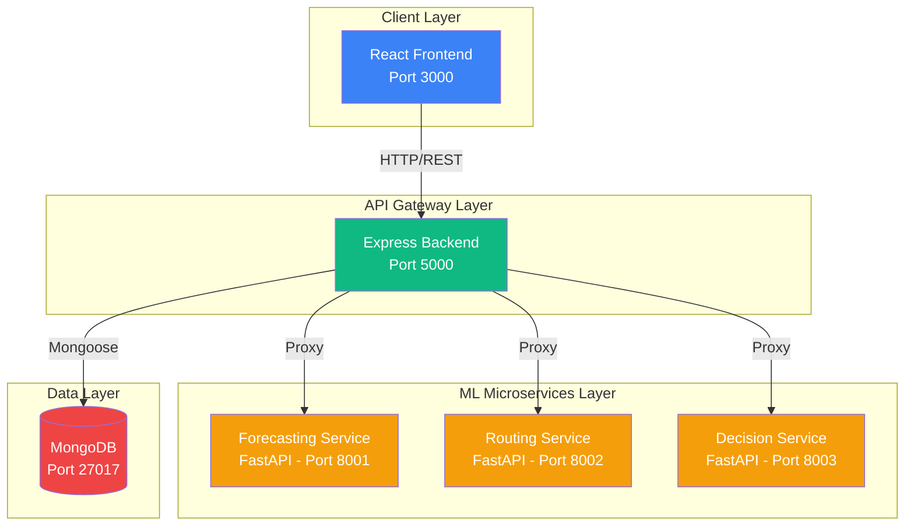

# System Architecture

## Overview

The Smart Disaster Prediction, Decision & Resource Allocation System (SDPD) is a microservices-based application designed to help manage disaster response in India. The system uses a combination of web technologies and machine learning to provide real-time predictions, routing optimization, and intelligent dispatch decisions.

## Architecture Diagram



## Component Details

### 1. Frontend (React + Vite + Tailwind CSS)

**Technology Stack:**
- React 18 for UI components
- Vite for fast development and building
- React Router for navigation
- Tailwind CSS for styling
- Leaflet for interactive maps
- Axios for API communication

**Pages:**
- **Dashboard**: System overview, health monitoring, statistics
- **Disaster Prediction**: Input parameters and get demand forecasts
- **Resource Map**: Interactive map showing district resources and severity
- **Dispatch Recommendation**: Get intelligent dispatch decisions

**Key Features:**
- Responsive design for mobile and desktop
- Real-time data visualization
- Interactive map with district markers
- Form-based input with validation

### 2. Backend Express (API Gateway)

**Technology Stack:**
- Node.js + Express
- Mongoose for MongoDB ODM
- JWT for authentication
- Axios for HTTP requests to ML services
- CORS for cross-origin requests

**Responsibilities:**
- User authentication and authorization
- Request routing and proxying to ML services
- Database operations (user management)
- Error handling and logging
- Health check endpoints

**Routes:**
- `/register`, `/login` - Authentication
- `/protected` - Protected route example
- `/api/forecast/*` - Proxy to forecasting service
- `/api/routing/*` - Proxy to routing service
- `/api/decision/*` - Proxy to decision service

### 3. ML Microservices (FastAPI)

#### Forecasting Service (Port 8001)

**Purpose**: Predict resource demand for disaster scenarios

**Input:**
- District name
- Disaster type (flood, earthquake, cyclone, etc.)
- Date features (month, season)
- Other features (population, rainfall)

**Output:**
- Predicted demand (food, water, medical supplies)
- Severity level
- Confidence score

**Current Implementation:**
- Placeholder logic using deterministic hash-based calculations
- TODO: Replace with trained ML model

#### Routing Service (Port 8002)

**Purpose**: Calculate optimal routes for resource delivery

**Input:**
- From district
- To district
- Vehicle type (truck, ambulance, drone)
- Constraints

**Output:**
- Route waypoints
- Travel time estimate
- Cost estimate
- Distance

**Current Implementation:**
- CSV-based distance matrix lookup
- Simple speed calculations
- TODO: Replace with advanced routing algorithm (A*, Dijkstra, or ML-based)

#### Decision Service (Port 8003)

**Purpose**: Recommend optimal dispatch decisions

**Input:**
- Severity level
- Weather conditions
- Traffic conditions
- Distance to site
- Hospital capacity
- Resource availability (ambulances, drones, trucks)

**Output:**
- Recommended dispatch action
- Confidence score
- Explanation
- Alternative options

**Current Implementation:**
- Rule-based decision system
- Multi-factor analysis
- TODO: Replace with trained ML classification/recommendation model

### 4. Database (MongoDB)

**Collections:**
- `users` - User accounts and authentication data

**Future Collections** (to be added):
- `disasters` - Historical disaster records
- `resources` - Resource inventory
- `dispatches` - Dispatch history
- `predictions` - Prediction logs

## Data Flow

### Disaster Prediction Flow

1. User submits prediction request via frontend
2. Frontend sends POST to `/api/forecast/demand`
3. Express backend proxies request to Forecasting Service
4. Forecasting Service processes request and returns prediction
5. Express returns response to frontend
6. Frontend displays results with visualization

### Routing Optimization Flow

1. User requests route from District A to District B
2. Frontend sends POST to `/api/routing/optimal-route`
3. Express proxies to Routing Service
4. Routing Service calculates optimal route using distance matrix
5. Response includes route, time, cost
6. Frontend displays route information

### Dispatch Decision Flow

1. User inputs situation parameters
2. Frontend sends POST to `/api/decision/recommend`
3. Express proxies to Decision Service
4. Decision Service analyzes parameters using rule-based logic
5. Returns decision, confidence, explanation, alternatives
6. Frontend displays recommendation with confidence indicator

## Communication Patterns

### Synchronous HTTP/REST

All services communicate via synchronous HTTP REST APIs:
- Frontend ↔ Backend: REST API calls
- Backend ↔ ML Services: HTTP proxying

### Authentication Flow

1. User registers/logs in via Express backend
2. Backend generates JWT token
3. Frontend stores token in localStorage
4. Frontend includes token in Authorization header for protected routes
5. Backend verifies token before processing requests

## Deployment Architecture

### Docker Compose Orchestration

All services run in Docker containers orchestrated by Docker Compose:

**Network**: `sdpd-network` (bridge)

**Services:**
- `mongo` - MongoDB database
- `backend-express` - Express API gateway
- `forecasting_service` - Forecasting ML service
- `routing_service` - Routing ML service
- `decision_service` - Decision ML service
- `frontend` - React application

**Health Checks**: Each service has health check endpoints for monitoring

**Volumes**: MongoDB data persisted in named volume `mongo-data`

## Scalability Considerations

### Horizontal Scaling

Each ML microservice can be scaled independently:
```yaml
docker-compose up --scale forecasting_service=3
```

### Load Balancing

For production, add a load balancer (e.g., Nginx) in front of services:
- Distribute requests across multiple instances
- Handle SSL termination
- Serve static frontend files

### Caching

Future improvements:
- Redis for caching frequent predictions
- CDN for frontend static assets
- Database query result caching

## Security

### Current Implementation

- JWT-based authentication
- Password hashing with bcrypt
- CORS configuration
- Environment variable management

### Production Recommendations

- Use HTTPS/TLS for all communications
- Implement rate limiting
- Add API key authentication for ML services
- Use secrets management (e.g., Docker secrets, HashiCorp Vault)
- Enable MongoDB authentication
- Implement request validation and sanitization

## Monitoring and Logging

### Current Logging

- Express: Morgan HTTP request logging
- FastAPI: Built-in logging
- Console logs for debugging

### Production Recommendations

- Centralized logging (ELK stack, Splunk)
- Application Performance Monitoring (APM)
- Error tracking (Sentry)
- Metrics collection (Prometheus + Grafana)
- Distributed tracing (Jaeger, Zipkin)

## Technology Choices

| Component | Technology | Rationale |
|-----------|-----------|-----------|
| Frontend | React + Vite | Fast development, modern tooling, component reusability |
| Styling | Tailwind CSS | Rapid UI development, consistent design system |
| Maps | Leaflet | Open-source, lightweight, India-focused |
| Backend | Express | Mature ecosystem, easy proxying, fast development |
| ML Services | FastAPI | High performance, automatic API docs, Python ML ecosystem |
| Database | MongoDB | Flexible schema, JSON-like documents, easy scaling |
| Orchestration | Docker Compose | Simple multi-container management, reproducible environments |

## Future Enhancements

1. **Real-time Updates**: WebSocket integration for live disaster updates
2. **Advanced Analytics**: Dashboard with historical trends and predictions
3. **Mobile App**: React Native mobile application
4. **Notification System**: SMS/Email alerts for critical events
5. **Multi-language Support**: Hindi, Tamil, Bengali, etc.
6. **Offline Mode**: Progressive Web App (PWA) capabilities
7. **Advanced ML Models**: Deep learning models for better predictions
8. **Integration**: Connect with government disaster management systems
